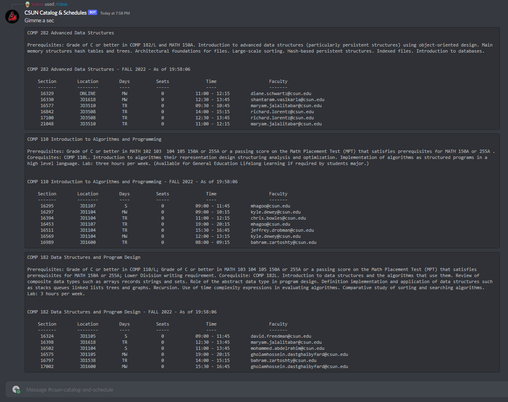
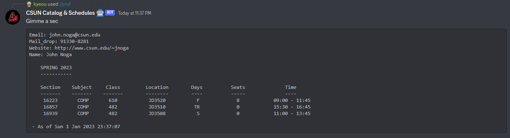

<!---Discord Bot:\
https://discord.com/api/oauth2/authorize?client_id=1001804710744948756&permissions=36507290688&scope=bot \
Help Command: !csun help or /help
-->

# How the Bot Works/How to Self-Host

## **The Crawler**
The crawler is a webscraper built in Typescript using Puppeteer that runs on a schedule (which can be found and changed in jobs/crawler/src/run.ts).
### The Arguments:
`-k (previously semester_key)`: On the schedule search tool at [this link](https://cmsweb.csun.edu/psc/CNRPRD/EMPLOYEE/SA/c/NR_SSS_COMMON_MENU.NR_SSS_SOC_BASIC_C.GBL?PortalActualURL=https%3a%2f%2fcmsweb.csun.edu%2fpsc%2fCNRPRD%2fEMPLOYEE%2fSA%2fc%2fNR_SSS_COMMON_MENU.NR_SSS_SOC_BASIC_C.GBL&PortalContentURL=https%3a%2f%2fcmsweb.csun.edu%2fpsc%2fCNRPRD%2fEMPLOYEE%2fSA%2fc%2fNR_SSS_COMMON_MENU.NR_SSS_SOC_BASIC_C.GBL&PortalContentProvider=SA&PortalCRefLabel=Class%20Search&PortalRegistryName=EMPLOYEE&PortalServletURI=https%3a%2f%2fmynorthridge.csun.edu%2fpsp%2fPANRPRD%2f&PortalURI=https%3a%2f%2fmynorthridge.csun.edu%2fpsc%2fPANRPRD%2f&PortalHostNode=EMPL&NoCrumbs=yes&PortalKeyStruct=yes), click the *Term dropdown, and the semester_key is the 4 digit number that precedes every 'Season Year' combo.
The reason this needs to be provided as an argument is because the dropdown uses that key as `<value>` attributes for each `<option>` in the dropdown, and thats how the crawler knows what to select.

`-c (previously cc) (concurrent)`: The crawler is a built in a manner that allows for concurrent webscraping of multiple subjects at a time. Only drawback here is that for every subject it has to use a separate browser instance. The portal uses some caching/cookie mecahanism that interferes with multiple tabs of the portal open, I still haven't figured out why this is. If you have a high amount of resources available to you, that can handle mutiple Chrome instances, you can use this flag to set concurrency. The default is 5.

`-i`: The crawler is set by default to run on schedule, therefore when running the run.js (after running `$ tsc` of course), it will not start immediately. If you want to run the crawl immediately, pass this flag. 

`-h (previously headless)`: I don't why you would want to do this but if you wanna peek into the bts of whats happening, you set this `false` to turn off headless mode. Of course to save resources, by default, its set to `new` (new headless mode in Puppeteer).
## **Database**
Quite simply, PostgreSQL is used because 'ol reliable' amirite? :). <br>
There is an aggregate backup sql file in [database/csun.sql](https://github.com/kyeou/CSUN-Catalog-and-Schedules/blob/main/database/csun.sql) that you can use to quickly to populate the database.
The database is named `csun`. There are 3 tables in this database <br>
### **`catalog`** 
All the classes in every subject. 
```sql
CREATE TABLE "catalog" (
    "subject" varchar(6) NOT NULL,
    "catalog_number" varchar(10) NOT NULL,
    "title" varchar(106) NOT NULL,
    "description" varchar(5000) NOT NULL,
    "units" varchar(3) NOT NULL,
    "prerequisites" varchar(474) NOT NULL,
    "corequisites" varchar(130) NOT NULL,
    "parsed_prereq" varchar(500) DEFAULT NULL,
    PRIMARY KEY ("subject", "catalog_number")
);
```

### **`professor`**
Contact information for every professor.
```sql
CREATE TABLE "professor" (
    "email" varchar(50) NOT NULL,
    "first_name" varchar(50) NOT NULL,
    "last_name" varchar(50) NOT NULL,
    "image_link" varchar(120) DEFAULT NULL,
    "phone_number" varchar(15) DEFAULT NULL,
    "location" varchar(60) DEFAULT NULL,
    "website" varchar(100) DEFAULT NULL,
    "mail_drop" varchar(15) DEFAULT NULL,
    "subject" varchar(6) DEFAULT NULL,
    "office" varchar(15) DEFAULT NULL,
    PRIMARY KEY ("email", "first_name", "last_name", "subject")
);
```
### **`section`**
Class schedules.
```sql
CREATE TABLE "section" (
  "class_number" int NOT NULL,
  "enrollment_cap" int DEFAULT NULL,
  "enrollment_count" int DEFAULT NULL,
  "instructor" varchar(100) DEFAULT NULL,
  "days" varchar(5) DEFAULT NULL,
  "location" varchar(60) DEFAULT NULL,
  "start_time" char(5) DEFAULT NULL,
  "end_time" char(5) DEFAULT NULL,
  "catalog_number" varchar(10) NOT NULL,
  "subject" varchar(6) NOT NULL,
  "waitlist_cap" int DEFAULT NULL,
  "waitlist_count" int DEFAULT NULL,
  "semester" varchar(6) NOT NULL,
  "year" int NOT NULL,
  PRIMARY KEY ("class_number","subject","catalog_number", "semester", "year"),
  CONSTRAINT "ck_semester" CHECK (("semester" in ('summer','fall','spring','winter')))
);
```
## **The Server**
Located in [bot/src/server.ts](https://github.com/kyeou/CSUN-Catalog-and-Schedules/blob/main/bot/src/server.ts), kinda self-explanatory what this is doing. This implements the API endpoints to interface with the database that is populated using the crawler mentioned earlier. 
## **The Bot**
Located at [bot/src/bot.ts](https://github.com/kyeou/CSUN-Catalog-and-Schedules/blob/main/bot/src/bot.ts). This implements the logic for the discord bot itself. `Instructions for self-hosting TBA.`


# Command Set

## Example 1: Single Class, Single Subject


## Example 2: Multiple Classes, Single Subject





## The default semester is either the current Fall or Spring semester or if in Summer, the upcoming Fall semester. 
### For other semesters append to end, subject YY, last 2 digits of year


Same input scheme for single subject input.


## Professor Search. 
### Either list all professors or view one by ID.

<br>



