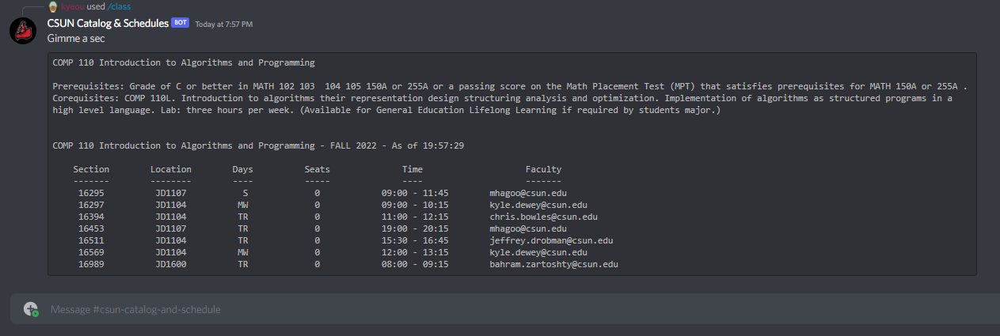
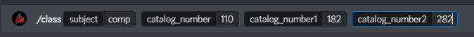
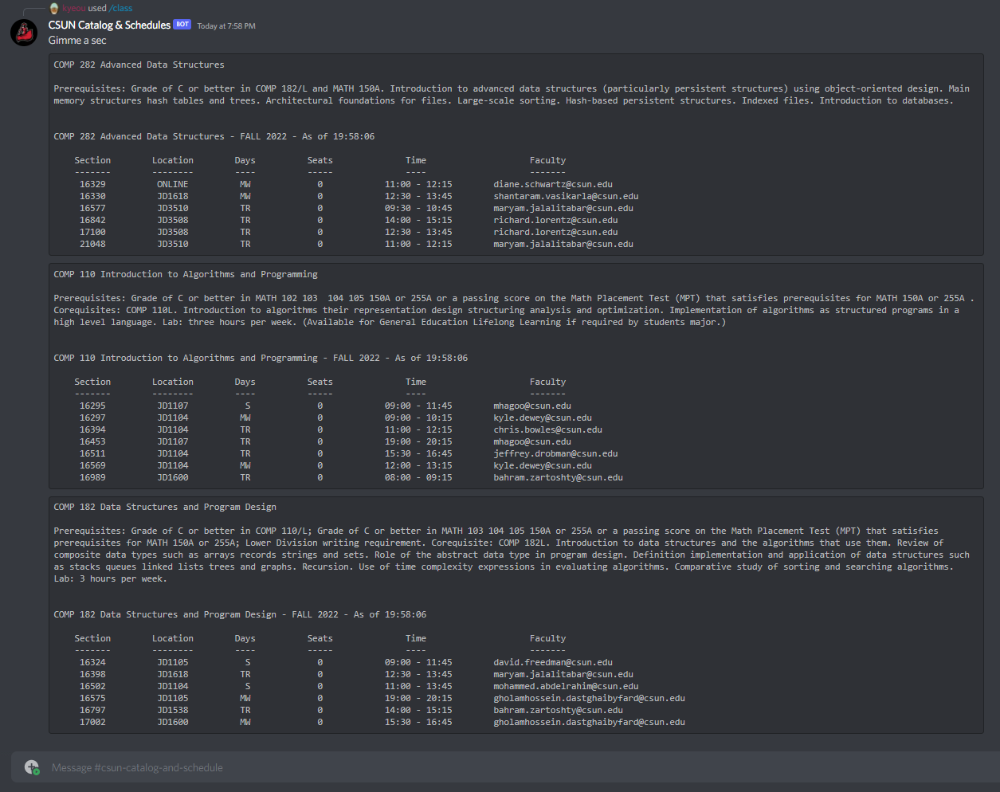
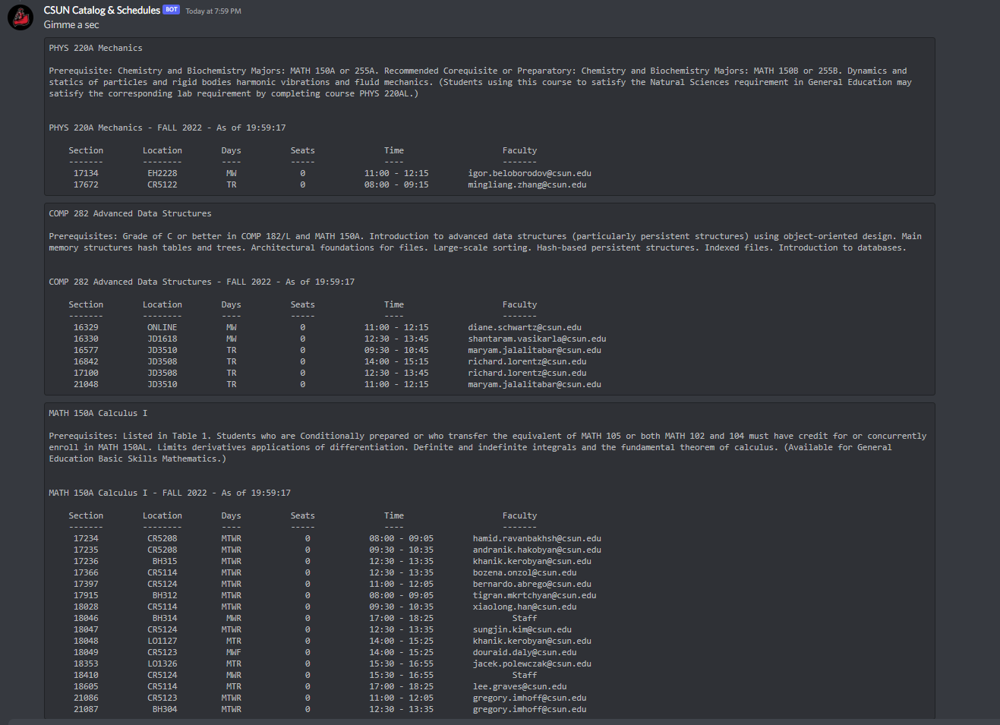

How to run:\
python show_schedules.py Semester Year SubjectCode\
Example:\
python show_schedules.py Fall 2022 COMP

How to run:\
python show_classes.py SubjectCode\
Example:\
python show_classes.py comp

Discord Bot Available:\
https://discord.com/api/oauth2/authorize?client_id=1001804710744948756&permissions=36507290688&scope=bot \
Help Command: !csun help

# Example 1: Single Class, Single Subject

# Example 2: Multiple Classes, Single Subject

# Example 3: Multiple Classes, Multiple Subjects

